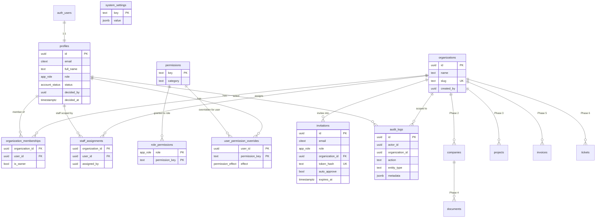

# Data-Model Proposal

PostgreSQL (Supabase) with UUID keys, `timestamptz` audit columns, explicit FKs, RLS on every
table, default-deny. Phase 1 builds the identity/tenancy/permission core; later phases add module
tables from spec §8 without changing this core.

## Tenancy & role model (key design decisions)

1. **Organization = client account (tenant).** Every client-owned record in every later module
   carries `organization_id`. A client user can belong to multiple organizations
   (`organization_memberships`), covering "one client owning multiple US companies" — companies
   (Phase 2) hang off organizations.
2. **Roles are platform-level, stored on `profiles.role`** (`client`, `moderator`, `manager`,
   `administrator`). Spec §7 defines administrator/manager/moderator as *internal staff* whose reach
   is "all clients" (administrator) or "assigned clients" (manager/moderator) — so staff scoping is a
   separate `staff_assignments` table rather than org membership.
3. **Granular permissions, not role-name checks.** `permissions` (catalogue) ×
   `role_permissions` (defaults per role) × `user_permission_overrides` (audited allow/deny per
   user). SQL `has_permission()` and the typed TS mirror consult the same matrix.
4. **Account lifecycle on `profiles.status`**: `pending_approval → active | rejected`, plus
   `suspended`/`deactivated`. Every RLS access helper requires `active`, so a pending/suspended
   account holds a session but reaches no tenant data.
5. **Audit from day one.** `audit_logs` is append-only (no UPDATE/DELETE granted, no policies for
   them); registration decisions, role changes, permission overrides, and membership changes write
   audit rows inside the same transaction.

## Phase 1 tables

| Table | Purpose | Notable columns / constraints |
| --- | --- | --- |
| `auth.users` | Supabase-managed identities | (managed by Supabase Auth; local test shim replicates shape) |
| `profiles` | 1:1 with `auth.users`; lifecycle + role | `id uuid PK → auth.users`, `email citext`, `full_name`, `role app_role default 'client'`, `status account_status default 'pending_approval'`, `registration_note`, `decided_by uuid`, `decided_at`, `decision_note`, timestamps. Trigger blocks self-service changes to `role`/`status`. |
| `organizations` | Tenant root | `id uuid PK`, `name`, `slug unique`, `created_by`, timestamps. |
| `organization_memberships` | Client ↔ tenant | `organization_id FK`, `user_id FK`, `is_owner bool`, `UNIQUE(organization_id, user_id)`. |
| `staff_assignments` | Manager/moderator scoping | `organization_id FK`, `user_id FK`, `assigned_by`, `UNIQUE(organization_id, user_id)`. |
| `permissions` | Permission catalogue | `key text PK` (e.g. `clients.approve_registration`), `description`, `category`. |
| `role_permissions` | Default role grants | `role app_role`, `permission_key FK`, `PK(role, permission_key)`. |
| `user_permission_overrides` | Audited per-user allow/deny | `user_id FK`, `permission_key FK`, `effect ('allow'|'deny')`, `reason`, `granted_by`, `PK(user_id, permission_key)`. Deny beats role grant; allow extends. |
| `invitations` | Invite-to-join lifecycle (acceptance flow completes in Phase 2) | `email citext`, `role app_role`, `organization_id nullable FK`, `token_hash unique` (raw token never stored), `auto_approve bool`, `invited_by`, `expires_at`, `accepted_at`, `revoked_at`. |
| `audit_logs` | Append-only audit trail | `actor_id`, `organization_id nullable`, `action`, `entity_type`, `entity_id`, `metadata jsonb`, `created_at`. Insert via SECURITY DEFINER helpers only. |
| `system_settings` | DB-backed admin settings (brand overrides etc.) | `key text PK`, `value jsonb`, `updated_by`, `updated_at`. |

Enums: `app_role = client | moderator | manager | administrator`;
`account_status = pending_approval | active | rejected | suspended | deactivated`;
`permission_effect = allow | deny`.

### SQL authorization helpers (SECURITY DEFINER, `search_path = ''`)

| Function | Semantics |
| --- | --- |
| `current_app_role()` | Role from caller's profile (`auth.uid()`), NULL when anonymous. |
| `is_active_user()` | Caller's profile status = `active`. |
| `is_administrator()` | Active + role `administrator`. |
| `is_staff()` | Active + role in (`administrator`,`manager`,`moderator`). |
| `is_org_member(org)` | Active + membership row exists. |
| `is_assigned_staff(org)` | Active staff + `staff_assignments` row exists. |
| `can_access_org(org)` | `is_administrator() OR is_org_member(org) OR is_assigned_staff(org)`. Single tenancy gate reused by every later module's policies. |
| `has_permission(perm)` | Active + (allow-override OR (role grant AND no deny-override)). |
| `approve_registration(user, decision, note)` | Requires `clients.approve_registration`; transitions `pending_approval → active|rejected`, stamps decider, writes audit row; rejects invalid states. |

## RLS policy matrix (Phase 1)

| Table | SELECT | INSERT | UPDATE | DELETE |
| --- | --- | --- | --- | --- |
| `profiles` | own row; administrators; assigned staff with `clients.view_assigned` (via shared org) | via signup trigger (definer) only | own row (trigger blocks `role`/`status`/decision cols); administrators with `clients.update` | — (lifecycle via status) |
| `organizations` | `can_access_org(id)` | `clients.create` | `clients.update` (admins) | — |
| `organization_memberships` | `can_access_org(organization_id)` | `users.roles.manage` | `users.roles.manage` | `users.roles.manage` |
| `staff_assignments` | administrators; the assigned staff member (own rows) | `users.roles.manage` | `users.roles.manage` | `users.roles.manage` |
| `permissions`, `role_permissions` | any authenticated | — (migrations/service role) | — | — |
| `user_permission_overrides` | own; administrators | `users.roles.manage` | `users.roles.manage` | `users.roles.manage` |
| `invitations` | `clients.create` or `invitations.approve` | `clients.create` | `invitations.approve` | — (revoke = update) |
| `audit_logs` | `audit.view` | definer helpers only | none (append-only) | none |
| `system_settings` | any authenticated (non-secret config) | `settings.manage` | `settings.manage` | `settings.manage` |

Anonymous (`anon`) has no policies anywhere → zero rows, all writes rejected.

## Mermaid ERD (Phase 1 core + Phase 2+ attachment points)

## Later-phase tables (reserved, from spec §8)

Companies: `companies`, `company_owners_members`, `company_addresses`,
`company_compliance_deadlines`, `company_update_requests` (Phase 2). Catalogue/projects:
`service_categories`, `services`, `service_plans`, `service_plan_items`, `workflow_templates`,
`workflow_template_steps`, `projects`, `project_assignments`, `project_milestones`,
`project_tasks`, `project_status_history`, `data_requests`, `data_request_submissions` (Phase 3).
Documents: `documents`, `document_versions`, `document_reviews` (Phase 4). Financial:
`quotations`, `quotation_versions`, `quotation_line_items`, `invoices`, `invoice_line_items`,
`payments`, `payment_proofs`, `wallet_accounts`, `wallet_ledger_entries` (Phase 5).
Communication: `conversations`, `conversation_participants`, `messages`, `message_attachments`,
`tickets`, `ticket_assignments` (Phase 6). Platform: `notifications`,
`notification_preferences`, `email_outbox`, `help_categories`, `help_articles`,
`perks_resources`, `feedback`, `mfa_methods`*, `recovery_codes`*, `sessions`* (Phase 2/7;
\* Supabase Auth provides native MFA factors and session storage — dedicated tables only if the
native model proves insufficient).

Every tenant-owned table will carry `organization_id` and reuse `can_access_org()` +
`has_permission()` in its policies, plus per-status queue indexes per spec §8.
